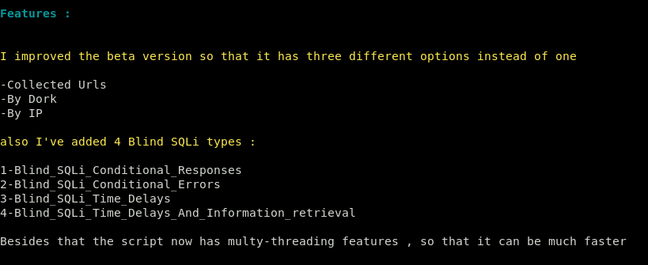

# 
...| يالله حيهم |...

# SQLi_Checker v1.1 :
<b>It's a tool to automate the process of testing websites against different SQLi types</b> 
 
   
 
 
 

# Installation :
<code>git clone https://github.com/Mesh3l911/SQLi_Checker_v1.1.git<code>
 

# Requirements :

<code>pip install -r requirements.txt</code>

# Features : 

 
# Usage :

1-Fire up the script and choose one of the three options. 
2-Just insert whatever it asks. 
3-Enjoy the results ^_* 

P.s: ( inurl ) should stay at the same folder as the script
 
# Version :

This is the first official version of SQLi_Checker_v1.1

