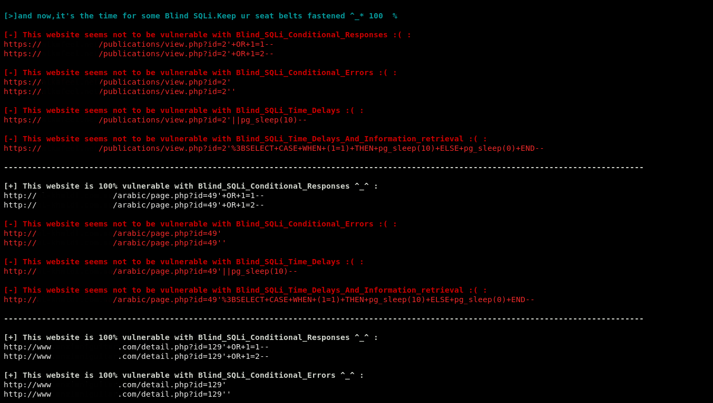

# 
...| يالله حيهم |...

# SQLi_Checker v1.1 :
<b>It's a tool to automate the process of testing websites against different SQLi types</b> 
 
   
 
 
 

# Requirements :

1-Python3  
2-You might need to import these modules : 

apt-get install requests 
apt-get install python3-bs4 
apt-get install threading 
apt-get install re 
apt-get install time 
 

# Installation :
git clone https://github.com/Mesh3l911/SQLi_Checker_v1.1.git
 

# Features :
I improved the beta version so that it has three different options instead of one  
 
-Collected Urls 
-By Dork 
-By IP 

also I've added 4 Blind SQLi types : 
 
1-Blind_SQLi_Conditional_Responses 
2-Blind_SQLi_Conditional_Errors 
3-Blind_SQLi_Time_Delays 
4-Blind_SQLi_Time_Delays_And_Information_retrieval 

Besides that the script now has multy-threading features , so that it can be much faster  

# Usage :

1-Fire up the script and choose one of the three options. 
2-Just insert whatever it asks. 
3-Enjoy the results ^_* 

P.s: ( inurl ) should stay at the same folder as the script
 
# Version :

This is the first official version of SQLi_Checker_v1.1

